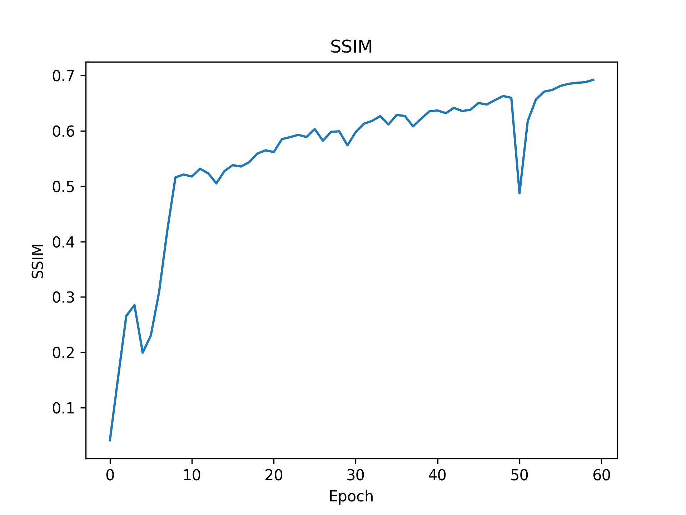
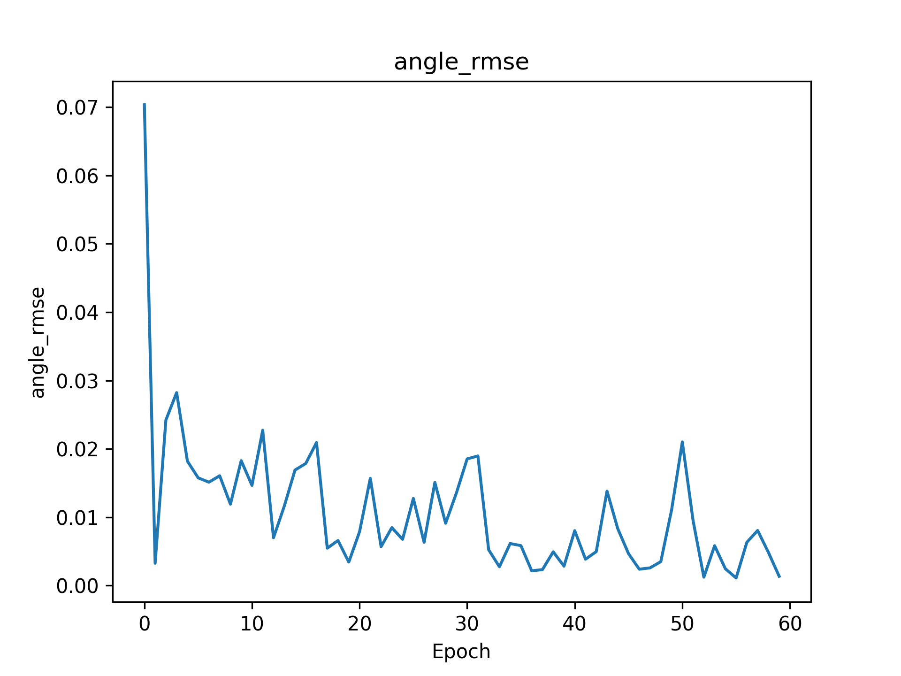
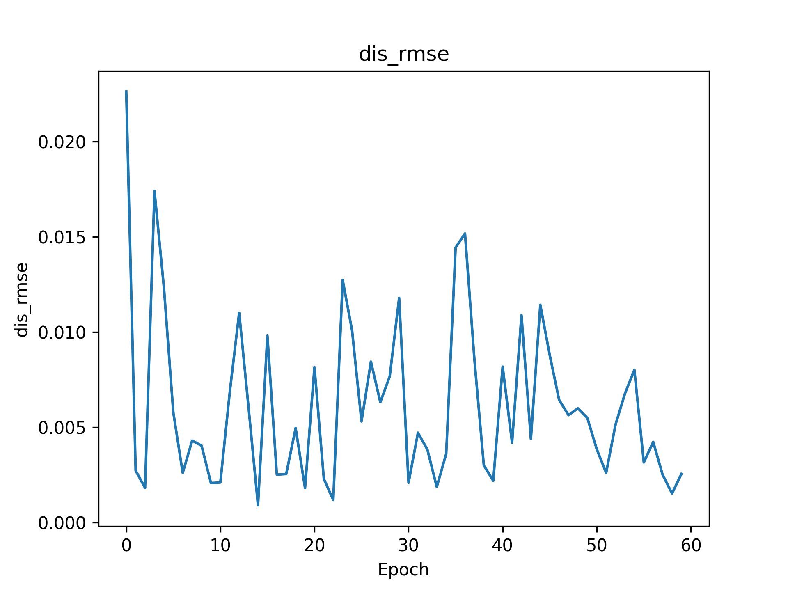

# SIMAC Real-Data Reproduction

A reproduction and engineering adaptation of the SIMAC framework using real CARLA-Sionna multimodal wireless data.

---

# Project Highlights

- Reproduced the SIMAC semantic communication framework
- Integrated real CARLA camera data and Sionna CIR channel data
- Built multimodal dataloader and training pipeline
- Implemented checkpoint saving and resume training
- Added visualization and metric evaluation tools

---

## Version Note

This repository is currently a v0.1 engineering reproduction of SIMAC.

The current version focuses on:
- reproducing the SIMAC training pipeline;
- adapting real CARLA-Sionna multimodal wireless data;
- integrating camera images and CIR/CSI channel information;
- building checkpoint, visualization, and metric evaluation tools.

This version is not a full reproduction of the original paper's VIRAT-based sensing-label construction. In the next version, I plan to implement paper-style label generation based on the original formulas for distance, angle, and velocity estimation.

---

# Reconstruction Results

## Ground Truth vs Reconstruction

---

# Training Curves

## Training Loss

## PSNR

## SSIM

---

# Sensing Metrics

## Angle RMSE

## Distance RMSE

## Rate RMSE

