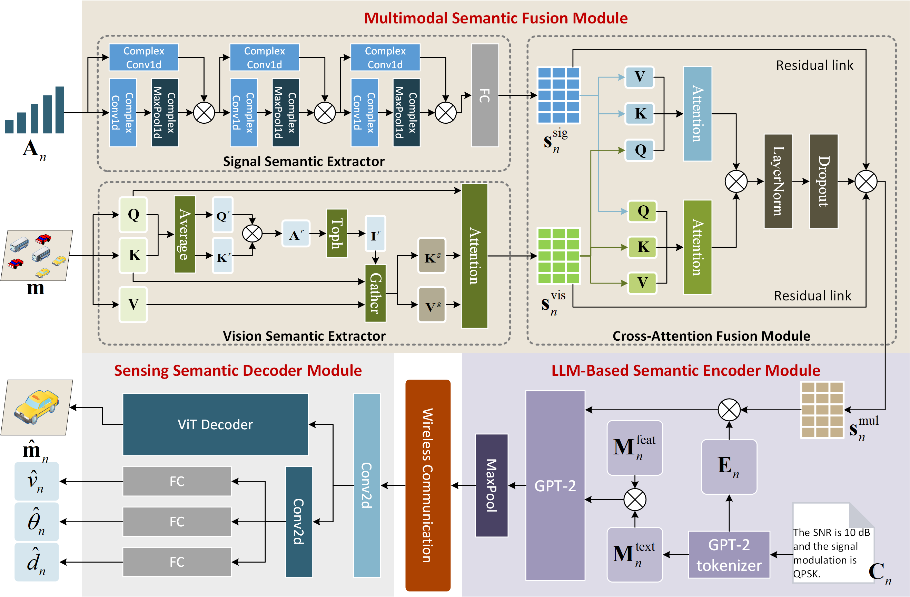

# Simac: A semantic-driven integrated multimodal sensing and communication framework
## Authors
### Yubo Peng, Luping Xiang, Kun Yang, Feibo Jiang, Kezhi Wang, and Dapeng Oliver Wu
## Paper
### [https://ieeexplore.ieee.org/abstract/document/11165352](https://ieeexplore.ieee.org/abstract/document/11165352)
## Code
### https://github.com/NJU-NINELab/SIMAC.git
## Abstract
Traditional single-modality sensing faces limitations in accuracy and capability, and its decoupled implementation with communication systems increases latency in bandwidth-constrained environments. Additionally, single-task-oriented sensing systems fail to address users' diverse demands. To overcome these challenges, we propose a semantic-driven integrated multimodal sensing and communication (SIMAC) framework. This framework leverages a joint source-channel coding architecture to achieve simultaneous sensing decoding and transmission of sensing results. Specifically, SIMAC first introduces a multimodal semantic fusion (MSF) network, which employs two extractors to extract semantic information from radar signals and images, respectively. MSF then applies cross-attention mechanisms to fuse these unimodal features and generate multimodal semantic representations. Secondly, we present a large language model (LLM)-based semantic encoder (LSE), where relevant communication parameters and multimodal semantics are mapped into a unified latent space and input to the LLM, enabling channel-adaptive semantic encoding. Thirdly, a task-oriented sensing semantic decoder (SSD) is proposed, in which different decoded heads are designed according to the specific needs of tasks. Simultaneously, a multi-task learning strategy is introduced to train the SIMAC framework, achieving diverse sensing services. Finally, experimental simulations demonstrate that the proposed framework achieves diverse sensing services and higher accuracy.


## Model Definition
See [model.py](model.py) for an overview of the SIMAC framework, including the MSF, LSE, and SSD modules.

## Model Training
```bash
accelerate launch --config_file accelerate_config.yaml Train.py
```
See [Train.py](Train.py) for more details of the training process of the SIMAC framework.

## Citation   
```
@ARTICLE{11165352,
  author={Peng, Yubo and Xiang, Luping and Yang, Kun and Jiang, Feibo and Wang, Kezhi and Wu, Dapeng Oliver},
  journal={IEEE Journal on Selected Areas in Communications}, 
  title={SIMAC: A Semantic-Driven Integrated Multimodal Sensing And Communication Framework}, 
  year={2025},
  volume={},
  number={},
  pages={1-1},
  keywords={Semantics;Radar;Integrated sensing and communication;Visualization;Multimodal sensors;Radar imaging;Accuracy;Multitasking;Decoding;Reviews;Integrated multimodal sensing and communications;semantic communication;large language model;multi-task learning},
  doi={10.1109/JSAC.2025.3610398}}

```

