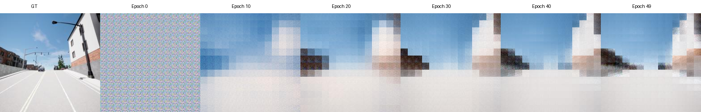
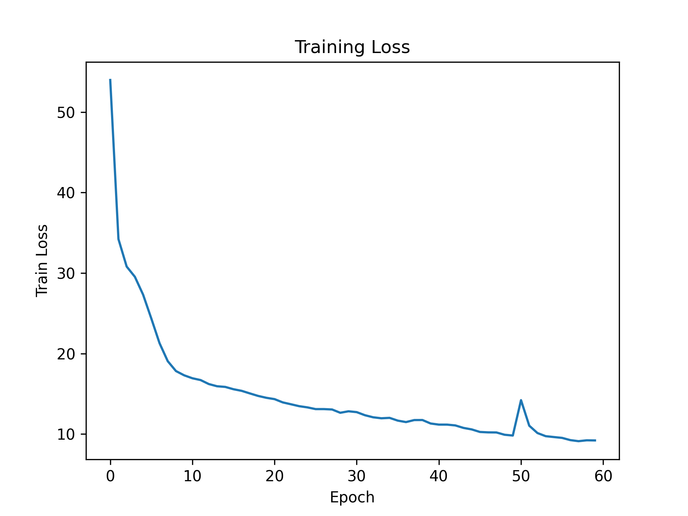
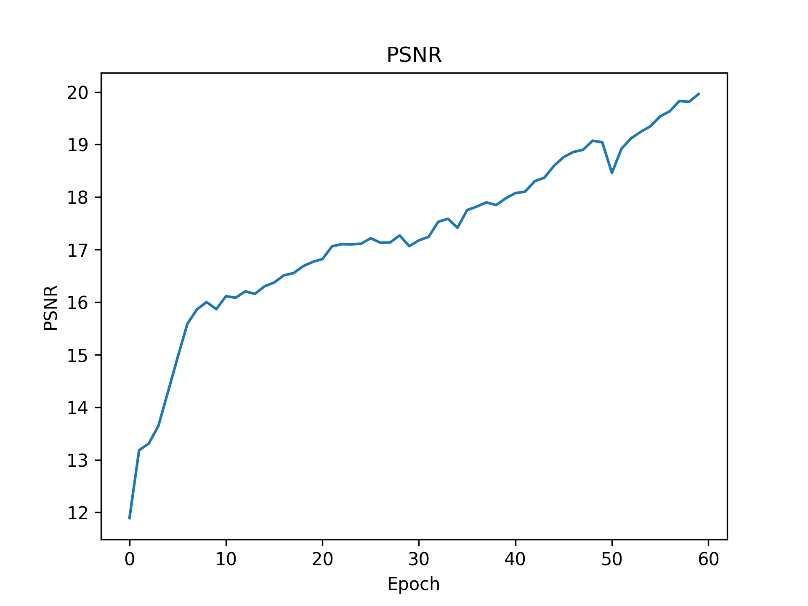
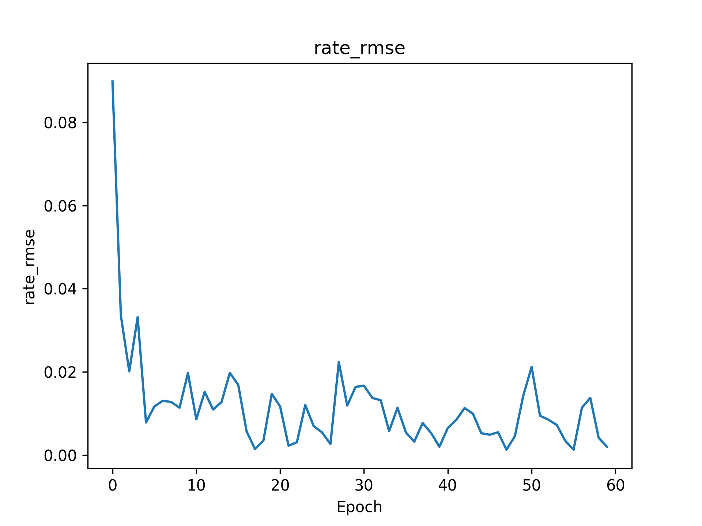

# SIMAC Real-Data Reproduction

A reproduction and engineering adaptation of the SIMAC framework using real CARLA-Sionna multimodal wireless data.

---

# Project Highlights

- Reproduced the SIMAC semantic communication framework
- Integrated real CARLA camera data and Sionna CIR channel data
- Built multimodal dataloader and training pipeline
- Implemented checkpoint saving and resume training
- Added visualization and metric evaluation tools

---

# Reconstruction Results

## Ground Truth vs Reconstruction

---

# Training Curves

## Training Loss

## PSNR

## SSIM

---

# Sensing Metrics

## Angle RMSE

## Distance RMSE

## Rate RMSE

